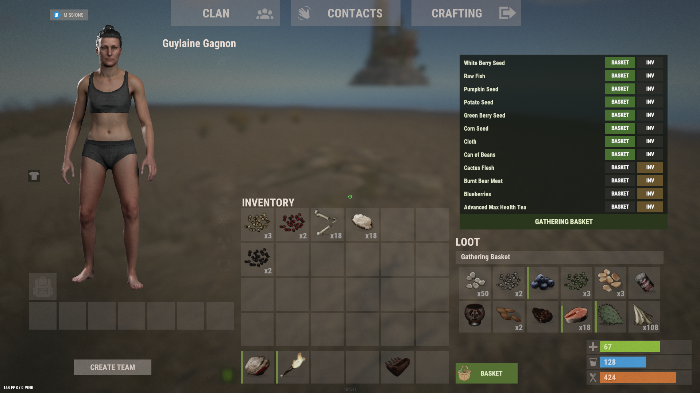
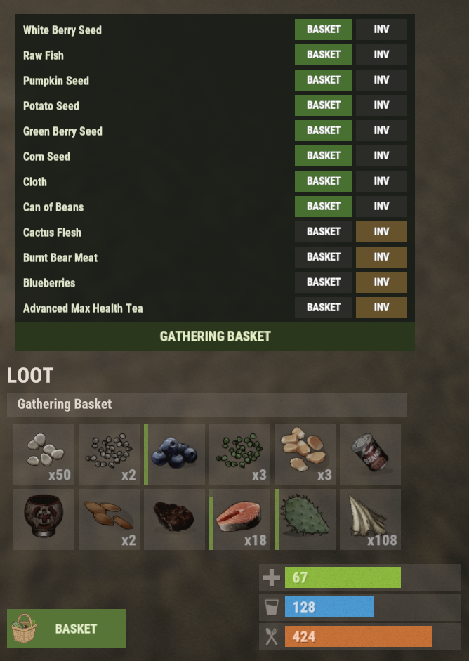

# Gathering Basket

A virtual extra inventory for farming and gathering in Rust. There is no physical basket item. Players get a small button, twelve specialized slots, per-item auto-routing, and crafting that can consume basket contents.

Inspired by the native inventory instead of a second backpack item: **no physical item, one inventory button, twelve virtual slots**.





## Features

- Virtual container (not an item, cannot be dropped, looted, or lost on death by default)
- Inventory button plus `/basket` and bindable `basket` console command
- Default 12 slots, configurable, with optional VIP capacity
- Only gathering-related items: cloth, plant fiber, worms, grubs, honey, compost, seeds, clones, berries, and Food-category items
- Native loot UI: drag-and-drop, splitting, and stacking use real Rust item containers
- Per-player, per-item routing: move a resource into the basket, then choose **B** (basket) or **I** (inventory)
- Auto-routing from harvest, pickup, farming, loot, craft output, and other grants
- If the basket is full, items fall back to the player inventory. Nothing is deleted
- Crafting uses Inventory + Basket. Default priority is basket first
- Persistent contents, seed genetics, and routing preferences
- Periodic autosave, save on disconnect, and save on server save
- Oxide/uMod permissions, admin inspect/clear, map-wipe reset options
- Optional [Item Retriever](https://umod.org/plugins/item-retriever) registration for other consume paths

## Permissions

This plugin uses the Oxide permission system.

`gatheringbasket.use` is granted to the `default` group on load, so every player can use the basket unless you revoke it.

```text
oxide.revoke group default gatheringbasket.use
oxide.grant user <name or steamid> gatheringbasket.admin
oxide.grant user <name or steamid> gatheringbasket.vip
oxide.grant user <name or steamid> gatheringbasket.reset
```

- `gatheringbasket.use`: open and use the basket (everyone by default)
- `gatheringbasket.admin`: `/basketadmin` commands
- `gatheringbasket.vip`: extra slots (`VipBasketSlots`)
- `gatheringbasket.reset`: `/basket reset` when `AllowPlayerReset` is false

Set `GrantUseToDefaultGroup` to `false` if you want to manage `gatheringbasket.use` yourself. The plugin will not revoke it automatically.

## Commands

Chat commands use a `/` prefix. Console commands use the same names without `/`. Bind example: `bind b basket`

- `/basket`: open or close your Gathering Basket
- `/basket reset`: empty your basket if allowed
- `/basketadmin view <player>`: open another player's basket
- `/basketadmin clear <player>`: empty another player's basket
- `/basketadmin resetroute <player>`: clear that player's routing preferences

## Player flow

1. Grant `gatheringbasket.use`
2. Open inventory. Click **BASKET** (or run `/basket`)
3. Move berries, cloth, seeds, etc. into the 12 slots
4. In the routing panel, press **B** to send future items of that type into the basket, or **I** to keep them in inventory
5. Harvest as usual. Routed items stack in the basket first
6. Craft as usual. Recipes can consume basket items without moving them back first

## Configuration

Default config (`oxide/config/GatheringBasket.json`):

```json
{
  "BasketSlots": 12,
  "VipBasketSlots": 18,
  "EnableAutoRouting": true,
  "EnableCraftingIntegration": true,
  "CraftingPriority": "BasketFirst",
  "KeepBasketOnDeath": true,
  "SaveRoutingPreferences": true,
  "AutoSaveInterval": 300,
  "AllowPlayerReset": false,
  "GrantUseToDefaultGroup": true,
  "ResetContentsOnMapWipe": true,
  "ResetRoutingOnMapWipe": true,
  "ShowInventoryButton": true,
  "ButtonText": "BASKET",
  "ButtonAnchorMin": "1 0",
  "ButtonAnchorMax": "1 0",
  "ButtonOffsetMin": "-447 18",
  "ButtonOffsetMax": "-335 54",
  "AllowedCategories": [ "Food" ],
  "AllowedShortnames": [
    "cloth",
    "plantfiber",
    "worm",
    "grub",
    "honey",
    "compost"
  ],
  "AllowedShortnamePrefixes": [ "seed.", "clone." ],
  "AllowedShortnameSuffixes": [ ".berry" ],
  "BlockedShortnames": []
}
```

- `CraftingPriority`: `BasketFirst` or `InventoryFirst`
- `KeepBasketOnDeath`: `true` keeps the virtual contents; they never go on the corpse
- `ResetContentsOnMapWipe`: empty baskets when a new map save is generated
- Allowed lists use Rust shortnames, prefixes, suffixes, and item categories. Display names are not used

## Installation

1. Copy `GatheringBasket.cs` into `oxide/plugins`
2. Optional: copy `icons/basket.png` to `oxide/data/GatheringBasket/basket.png` for the inventory button icon
3. Reload or wait for Oxide to compile it
4. Open inventory and click **BASKET**, or use `/basket`. Every player can use it by default.

## Notes

- The basket is a hidden server-side container. Items keep amount, condition, skin, and seed genetics
- Auto-routing never runs on items you move yourself between inventory and basket
- If both the basket and inventory are full, Rust's normal drop/overflow behavior is left alone
- Compatible with stack-size and gather-rate plugins because it uses live `Item` stacks
- Compatible with Carbon as well as Oxide/uMod as long as standard Rust hooks are present
- Progression (12/18 slots), ore pouches, and shared clan storage are not in this version; capacity is already permission-based

## License

MIT. See LICENSE.md.
